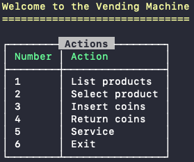

# h-challenge

### Are you thirsty?



## Setup

Setup the infrastructure

```
$ make setup
```

Performs the following tasks:

- Builds the containers
- Installs composer dependencies

## Start

Start the application (vending machine)

```
$ make start
```

## Up/Down

Brings the application up

```
$ make up
```

Brings the application down

```
$ make down
```

## Testing

To run tests execute the following:

```
$ make test
```

## Machine

To execute a command inside the machine run the following:

```
$ make console <command-to-execute>
```

## Other

- Symfony 5.2
- PHP 7.4-cli
